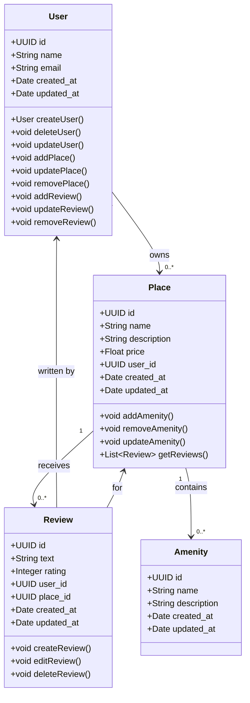

```mermaid
classDiagram
class User {
    +UUID id
    +String name
    +String email
    +Date created_at
    +Date updated_at
    +User createUser()
    +void deleteUser()
    +void updateUser()
    +void addPlace()
    +void updatePlace()
    +void removePlace()
    +void addReview()
    +void updateReview()
    +void removeReview()
}

class Place {
    +UUID id
    +String name
    +String description
    +Float price
    +UUID user_id
    +Date created_at
    +Date updated_at
    +void addAmenity()
    +void removeAmenity()
    +void updateAmenity()
    +List~Review~ getReviews()
}

class Review {
    +UUID id
    +String text
    +Integer rating
    +UUID user_id
    +UUID place_id
    +Date created_at
    +Date updated_at
    +void createReview()
    +void editReview()
    +void deleteReview()
}

class Amenity {
    +UUID id
    +String name
    +String description
    +Date created_at
    +Date updated_at
}

User "1" --> "0..*" Place : owns
Place "1" --> "0..*" Review : receives
Place "1" --> "0..*" Amenity : contains
Review --> User : written by
Review --> Place : for
```