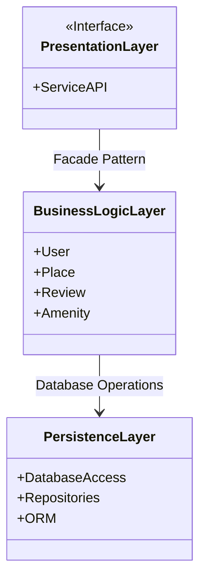
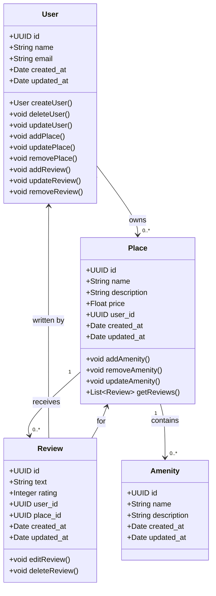
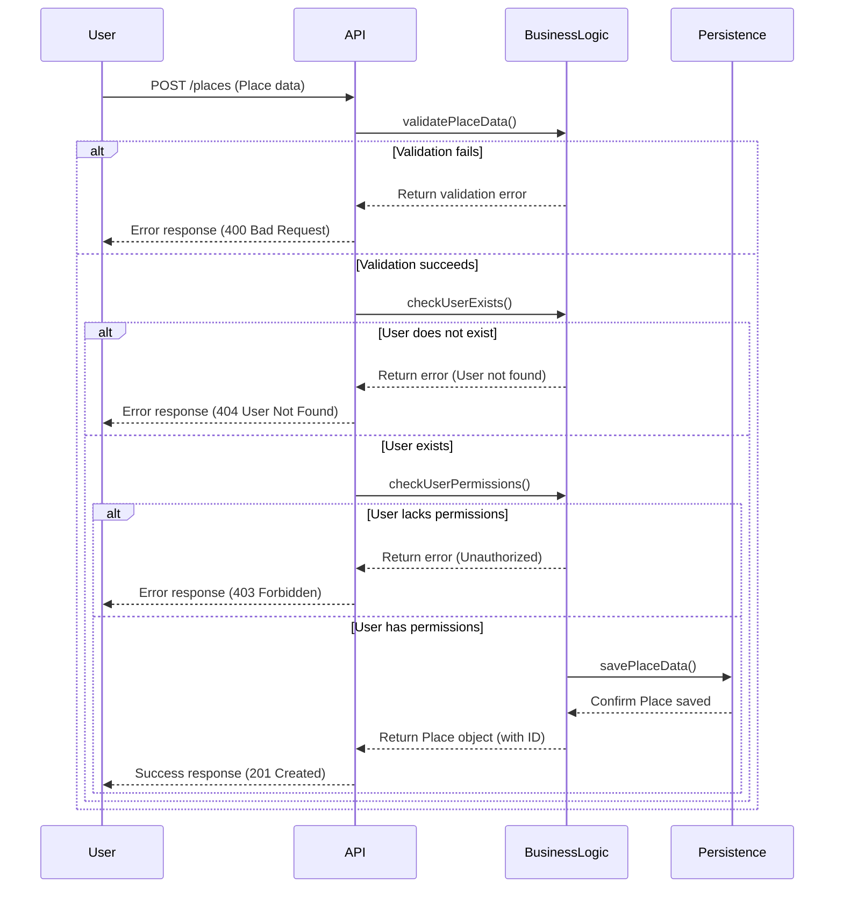
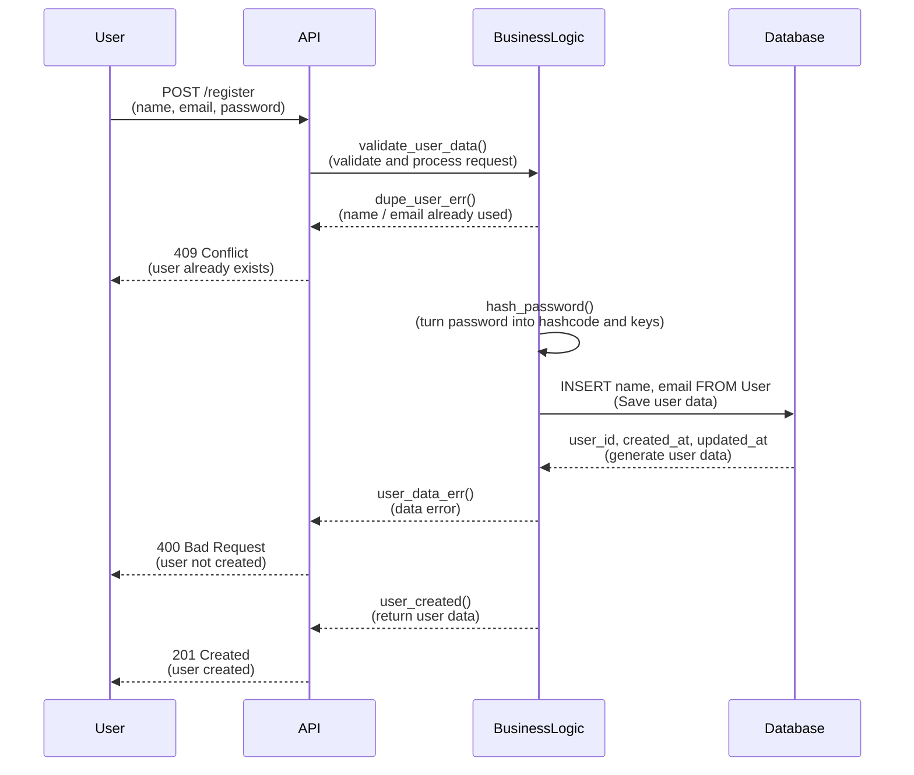
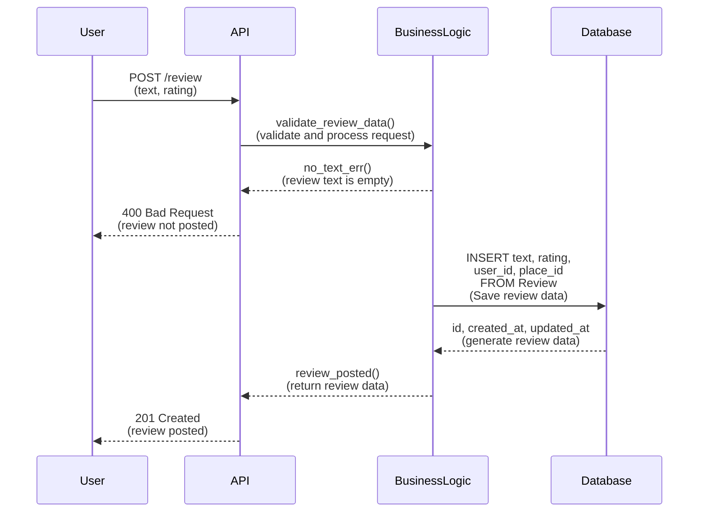
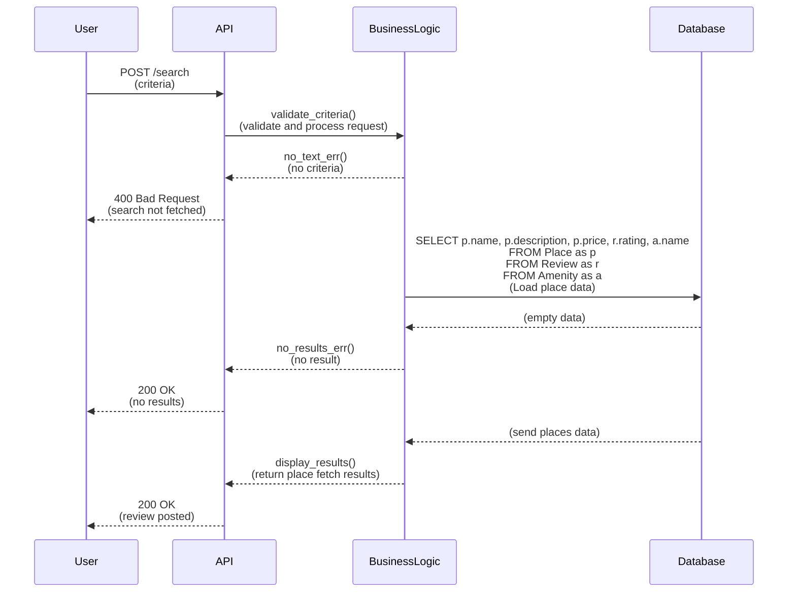

## Introduction

Le projet HBnB est une plateforme de gestion d'hébergement et d'avis qui permet aux utilisateurs de publier des lieux (places), de soumettre des avis (reviews) et d'associer des commodités (amenities) aux lieux. Ce document sert de guide technique complet pour le projet, fournissant une vue d'ensemble de l'architecture du système et des flux d'interaction entre les différentes couches de l'application. 

L'objectif de ce document est de regrouper et d'expliquer les différents diagrammes créés dans le cadre des phases de conception du projet. Ces diagrammes incluent :
- Un diagramme de package pour représenter l'architecture en trois couches.
- Un diagramme de classe détaillant la couche logique métier.
- Des diagrammes de séquence pour illustrer les interactions des appels API clés.

Ce document sera utilisé comme référence tout au long du projet pour guider l'implémentation des fonctionnalités, assurer la conformité avec les spécifications de conception et faciliter la communication entre les membres de l'équipe de développement.

---

## 1. Architecture de Haut Niveau

### Diagramme de Package de l'Architecture

### Explication de l'Architecture

L'architecture de HBnB est basée sur une **architecture en trois couches** qui sépare les responsabilités principales de l'application en trois niveaux :
- **Couche de présentation** (Services, API) : Gère l'interaction utilisateur et expose les API nécessaires pour interagir avec l'application. 
- **Couche de logique métier** (Modèles) : Contient la logique métier principale, incluant les modèles représentant les entités clés comme `User`, `Place`, `Review` et `Amenity`.
- **Couche de persistance** : Responsable de la gestion des opérations liées à la base de données, comme l'accès et la persistance des données.

Le **Facade Pattern** (modèle de façade) est utilisé pour simplifier les interactions entre les couches, garantissant que la couche de présentation interagit uniquement avec la logique métier via une interface bien définie, tandis que la couche de persistance est isolée et gérée via des appels spécifiques.

---

## 2. Couche de Logique Métier

### Diagramme de Classe

### Explication du Diagramme de Classe

La couche logique métier est représentée par quatre entités principales :
- **User** : Un utilisateur qui possède des lieux et peut laisser des avis.
- **Place** : Un lieu publié par un utilisateur, qui peut être évalué et lié à plusieurs commodités.
- **Review** : Un avis laissé par un utilisateur sur un lieu particulier.
- **Amenity** : Un service ou une commodité associée à un lieu.

Les **associations** entre les entités sont également représentées :
- Un utilisateur peut posséder plusieurs lieux (relation "un à plusieurs").
- Un lieu peut recevoir plusieurs avis et être associé à plusieurs commodités.

Chaque entité a des **attributs** standards comme `id`, `created_at` et `updated_at`, et des **méthodes** pour gérer les interactions (par exemple, `addPlace()` pour `User`, ou `getReviews()` pour `Place`).

---

## 3. Flux d'Interaction API

#### 1. **Diagramme de Séquence pour la Création d'un Lieu (Place)**

**Explication :**
Ce diagramme montre le flux de création d'un lieu par un utilisateur. Voici les étapes clés :
- L'utilisateur envoie une requête **POST** à l'API avec les données du lieu à créer.
- La couche API transmet ces données à la couche logique métier pour validation :
  - Si les données sont invalides, une erreur est renvoyée avec un message `400 Bad Request`.
  - Si les données sont valides, la couche logique métier vérifie si l'utilisateur existe et s'il dispose des autorisations requises pour créer un lieu.
- Si l'utilisateur n'existe pas, une erreur `404 User Not Found` est retournée.
- Si l'utilisateur n'a pas les droits nécessaires, une réponse `403 Forbidden` est envoyée.
- Si tout est en ordre, les données du lieu sont sauvegardées dans la base de données via la couche de persistance, et une réponse `201 Created` avec les informations du lieu est renvoyée à l'utilisateur.

---

#### 2. **Diagramme de Séquence pour l'Enregistrement d'Utilisateur (User Registration)**

**Explication :**
Ce diagramme illustre le processus d'enregistrement d'un nouvel utilisateur :
- L'utilisateur envoie une requête **POST** avec son nom, adresse e-mail et mot de passe.
- L'API passe les données à la couche logique métier pour validation :
  - Si l'utilisateur existe déjà (même nom ou e-mail), une erreur `409 Conflict` est renvoyée.
  - Si l'utilisateur est nouveau, le mot de passe est haché pour la sécurité.
- Les données de l'utilisateur sont ensuite sauvegardées dans la base de données via la couche de persistance.
- Une fois l'utilisateur créé, une réponse `201 Created` avec les détails de l'utilisateur est renvoyée.

---

#### 3. **Diagramme de Séquence pour la Soumission d'un Avis (Review Submission)**

**Explication :**
Ce diagramme décrit le processus de soumission d'un avis pour un lieu :
- L'utilisateur soumet un avis via une requête **POST** avec le texte de l'avis et une note.
- La couche API transmet les données à la couche logique métier pour validation :
  - Si le texte de l'avis est vide, une erreur `400 Bad Request` est renvoyée.
  - Si l'avis est valide, les données de l'avis (texte, note, ID de l'utilisateur, ID du lieu) sont sauvegardées dans la base de données via la couche de persistance.
- Une fois l'avis enregistré, une réponse `201 Created` est envoyée à l'utilisateur avec les détails de l'avis créé.

#### Diagramme de Séquence pour la Récupération d'une Liste de Lieux (Fetching a List of Places)

### Explication :

Ce diagramme illustre le flux d'interaction lors de la récupération d'une liste de lieux en fonction de critères de recherche fournis par l'utilisateur.

1. **Requête de l'utilisateur** : L'utilisateur envoie une requête **POST** à l'API avec des critères de recherche (ex. localisation, prix, commodités).
2. **Validation des critères** : L'API transmet les critères à la couche de logique métier pour validation.
   - Si aucun critère valide n'est fourni, une erreur `400 Bad Request` est renvoyée.
   - Si les critères sont valides, le processus continue.

3. **Interrogation de la base de données** :
   - La couche de logique métier demande à la base de données de charger les données des lieux correspondant aux critères fournis. Les données récupérées incluent des informations sur les lieux (`Place`), les avis (`Review`), et les commodités (`Amenity`).

4. **Traitement des résultats** :
   - Si aucune donnée ne correspond aux critères, un message indiquant "aucun résultat" est renvoyé à l'utilisateur avec un code `200 OK`.
   - Si des lieux sont trouvés, les données des lieux sont renvoyées à l'API, qui les envoie ensuite à l'utilisateur avec un code `200 OK`, affichant la liste des lieux.

## Conclusion

Ce document fournit une vue d'ensemble complète de l'architecture du projet HBnB, illustrant les interactions entre les différentes couches via des diagrammes de package, de classe et de séquence. Chaque diagramme a été conçu pour clarifier la conception du système et guider les développeurs tout au long de l'implémentation.

Les diagrammes expliquent clairement comment les données circulent entre les couches, comment les entités interagissent, et quelles sont les étapes critiques pour la création de fonctionnalités comme l'ajout de lieux, la soumission d'avis ou l'enregistrement d'un utilisateur. Ce document servira de référence essentielle tout au long du cycle de développement.