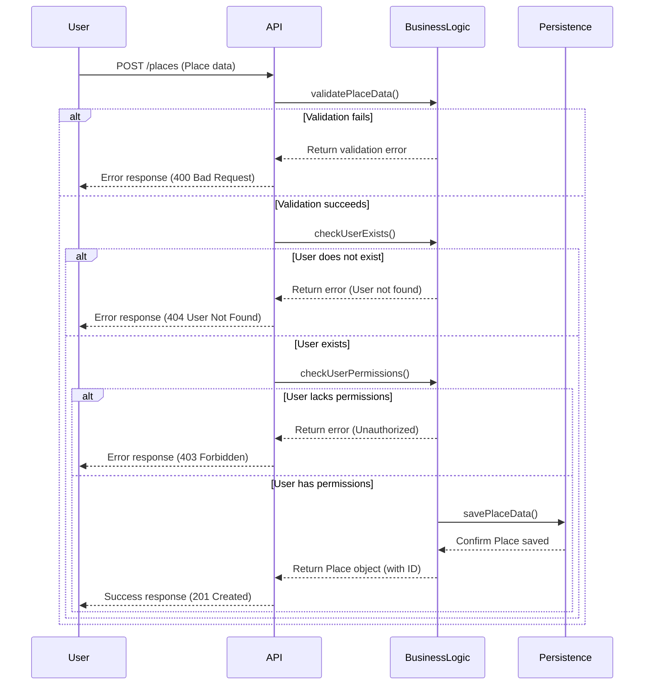

```mermaid
sequenceDiagram
    participant User
    participant API
    participant BusinessLogic
    participant Persistence

    User->>API: POST /places (Place data)
    API->>BusinessLogic: validatePlaceData()
    alt Validation fails
        BusinessLogic-->>API: Return validation error
        API-->>User: Error response (400 Bad Request)
    else Validation succeeds
        API->>BusinessLogic: checkUserExists()
        alt User does not exist
            BusinessLogic-->>API: Return error (User not found)
            API-->>User: Error response (404 User Not Found)
        else User exists
            API->>BusinessLogic: checkUserPermissions()
            alt User lacks permissions
                BusinessLogic-->>API: Return error (Unauthorized)
                API-->>User: Error response (403 Forbidden)
            else User has permissions
                BusinessLogic->>Persistence: savePlaceData()
                Persistence-->>BusinessLogic: Confirm Place saved
                BusinessLogic-->>API: Return Place object (with ID)
                API-->>User: Success response (201 Created)
            end
        end
    end
```