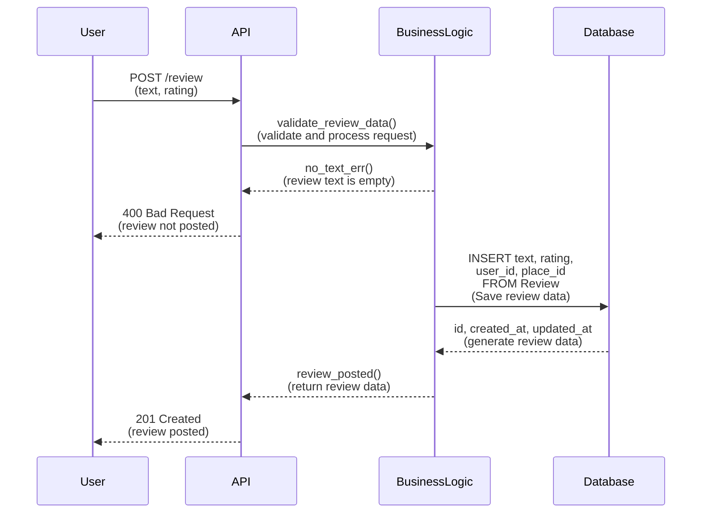

```mermaid
sequenceDiagram

User->>API: POST /review<br>(text, rating)
API->>BusinessLogic: validate_review_data()<br>(validate and process request)
BusinessLogic-->>API: no_text_err()<br>(review text is empty)
API-->>User: 400 Bad Request<br>(review not posted)

BusinessLogic->>Database: INSERT text, rating,<br>user_id, place_id<br>FROM Review<br>(Save review data)
Database-->>BusinessLogic: id, created_at, updated_at<br>(generate review data)
BusinessLogic-->>API: review_posted()<br>(return review data)
API-->>User: 201 Created<br>(review posted)
```
