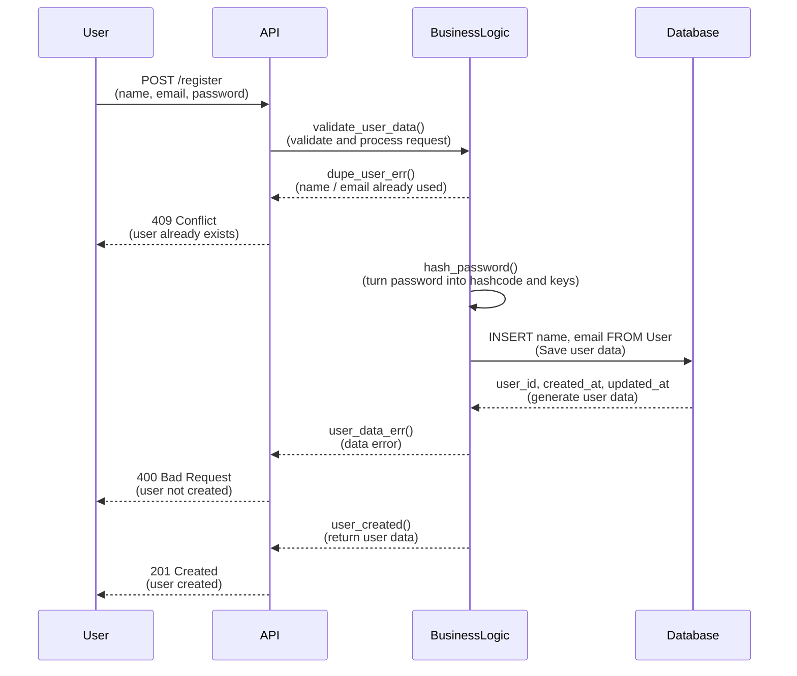

```mermaid
sequenceDiagram

User->>API: POST /register<br>(name, email, password)
API->>BusinessLogic: validate_user_data()<br>(validate and process request)
BusinessLogic-->>API: dupe_user_err()<br>(name / email already used)
API-->>User: 409 Conflict<br>(user already exists)

BusinessLogic->>BusinessLogic: hash_password()<br>(turn password into hashcode and keys)
BusinessLogic->>Database: INSERT name, email FROM User<br>(Save user data)
Database-->>BusinessLogic: user_id, created_at, updated_at<br>(generate user data)
BusinessLogic-->>API: user_data_err()<br>(data error)
API-->>User: 400 Bad Request<br>(user not created)

BusinessLogic-->>API: user_created()<br>(return user data)
API-->>User: 201 Created<br>(user created)
```
